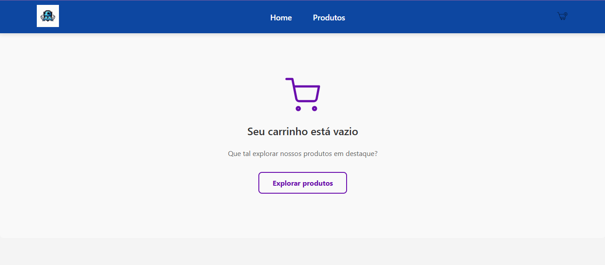
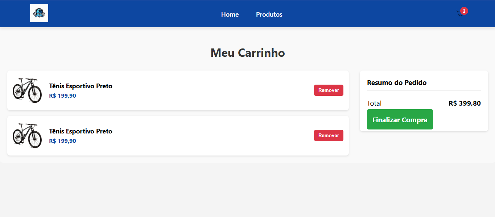

# 🛒 AA Sports - Loja Virtual

Bem-vindo à AA Sports, um projeto de e-commerce de artigos desportivos desenvolvido com React. Esta aplicação simula uma experiência de compra online, desde a visualização dos produtos até à finalização da compra.

## ✨ Funcionalidades Principais

O projeto conta com as seguintes funcionalidades:

- **Visualização de Produtos:** Uma grelha de produtos responsiva e estilizada na página inicial e na página de produtos.
- **Carrinho de Compras:** Adicione e remova produtos do carrinho de compras de forma dinâmica.
- **Gestão de Estado com Context API:** O estado do carrinho é gerido de forma global e eficiente através da Context API do React.
- **Navegação entre Páginas:** Utilização do `react-router-dom` para criar uma navegação fluida entre as páginas Home, Produtos, Carrinho e Checkout.
- **Páginas Estilizadas:** Interfaces de utilizador modernas para o carrinho (tanto no estado cheio como no vazio) e uma página de confirmação de compra.
- **Cabeçalho Dinâmico:** O cabeçalho exibe um contador de itens no carrinho e destaca a página atualmente ativa.

## 🚀 Tecnologias Utilizadas

Este projeto foi construído com as seguintes tecnologias:

- [**React.js**](https://reactjs.org/) - Uma biblioteca JavaScript para construir interfaces de utilizador.
- [**React Router**](https://reactrouter.com/) - Para a gestão de rotas e navegação declarativa.
- [**React Context API**](https://reactjs.org/docs/context.html) - Para a gestão de estado do carrinho de compras.
- **CSS3** - Para a estilização dos componentes e layout, com uso de Flexbox e Grid.
- **JavaScript (ES6+)**

## ⚙️ Como Executar o Projeto Localmente

Para executar este projeto na sua máquina, siga os passos abaixo:

**Primeiro faça um fork deste repositorio**

1.  **Clone o repositório:**
    ```bash
    git clone https://URL_DO_SEU_REPOSITORIO.git
    ```

2.  **Navegue até a pasta do projeto:**
    ```bash
    cd aa-sports
    ```

3.  **Instale as dependências:**
    (Certifique-se de que tem o [Node.js](https://nodejs.org/) instalado)
    ```bash
    npm install
    ```

4.  **Inicie o servidor de desenvolvimento:**
    ```bash
    npm start
    ```

5.  Abra [http://localhost:3000](http://localhost:3000) no seu navegador para ver a aplicação.

## 📸 Screenshots

*(DICA: Substitua os links abaixo pelas suas próprias imagens para mostrar o seu incrível trabalho!)*

**Página Inicial**


**Carrinho de Compras Vazio**


**Carrinho de Compras**


**Página de Checkout**


---
_